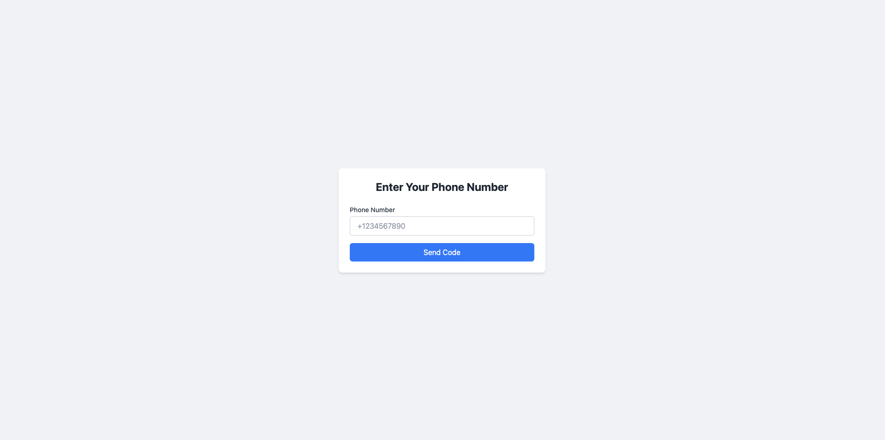
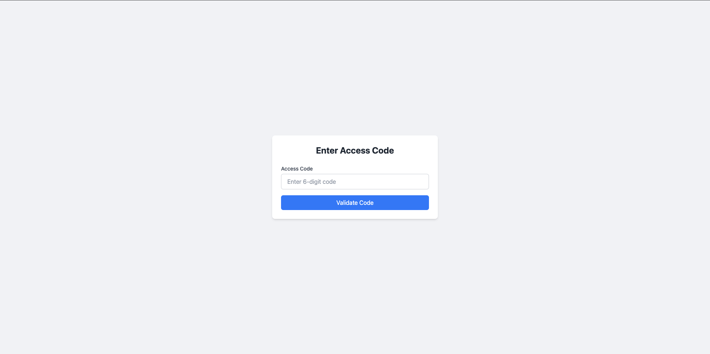
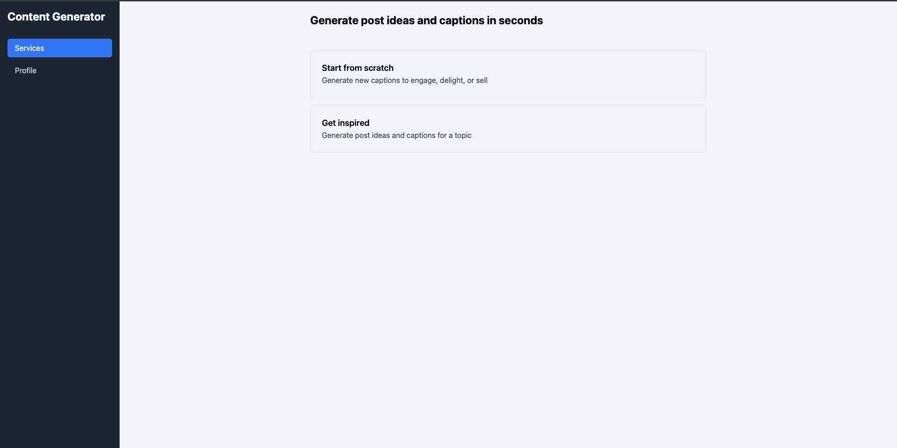

# Social Content Generator

Ứng dụng giúp tạo nội dung cho mạng xã hội một cách nhanh chóng và thông minh, sử dụng AI để tạo ra các caption phù hợp với từng nền tảng.

## Tính năng chính

- 🔐 **Xác thực người dùng**
  - Đăng nhập bằng số điện thoại
  - Xác thực OTP qua SMS

- 📝 **Tạo nội dung từ đầu**
  - Chọn mạng xã hội (Facebook/Instagram/Twitter)
  - Nhập chủ đề và tone giọng
  - Tạo 5 caption phù hợp

- 💡 **Lấy ý tưởng cho bài đăng**
  - Nhập chủ đề để nhận gợi ý
  - Chọn ý tưởng để tạo caption
  - Tạo caption dựa trên ý tưởng đã chọn

- 💾 **Quản lý nội dung**
  - Lưu caption yêu thích
  - Xem lại các caption đã lưu
  - Xóa caption không cần thiết

- 📤 **Chia sẻ nội dung**
  - Chia sẻ trực tiếp lên Facebook
  - Chia sẻ qua email

## Công nghệ sử dụng

### Frontend
- React.js
- TailwindCSS
- Axios
- React Hot Toast

### Backend
- Node.js
- Express.js
- Firebase Admin SDK
- Google Gemini AI

### Database & Authentication
- Firebase Firestore
- Firebase Authentication

## Cài đặt và Chạy

### Yêu cầu hệ thống
- Node.js (v14 trở lên)
- npm hoặc yarn
- Firebase project
- Google Gemini API key

### Cài đặt Frontend

```bash
# Di chuyển vào thư mục frontend
cd frontend

# Cài đặt dependencies
npm install

# Chạy ứng dụng trong môi trường development
npm start
```

### Cài đặt Backend

```bash
# Di chuyển vào thư mục backend
cd backend

# Cài đặt dependencies
npm install

# Tạo file .env và cấu hình các biến môi trường
cp .env.example .env

# Chạy server trong môi trường development
npm start
```

### Cấu hình môi trường

Tạo file `.env` trong thư mục backend với các thông tin sau:

```env
PORT=5001
FIREBASE_SERVICE_ACCOUNT={"your-firebase-service-account-json"}
GEMINI_API_KEY=your-gemini-api-key
```

## Cấu trúc thư mục

```
social-content-generator/
├── frontend/
│   ├── public/
│   └── src/
│       ├── components/
│       │   └── dashboard/
│       │       ├── ServicesTab.js
│       │       └── ProfileTab.js
│       └── App.js
└── backend/
    ├── src/
    │   ├── config/
    │   │   ├── firebase.js
    │   │   └── gemini.js
    │   ├── controllers/
    │   │   └── contentController.js
    │   ├── routes/
    │   │   └── contentRoutes.js
    │   └── index.js
    └── package.json
```

## API Endpoints

### Content Generation
- `POST /api/content/generate-captions`: Tạo caption mới
- `POST /api/content/get-ideas`: Lấy danh sách ý tưởng
- `POST /api/content/create-captions-from-idea`: Tạo caption từ ý tưởng

### Content Management
- `POST /api/content/save`: Lưu caption
- `GET /api/content/user-contents`: Lấy danh sách caption đã lưu
- `POST /api/content/unsave`: Xóa caption





(screenshot/image4.png)
(screenshot/image5.png)
(screenshot/image6.png)
(screenshot/image7.png)
(screenshot/image8.png)
(screenshot/image9.png)
(screenshot/image10.png)
# social-content-generator
